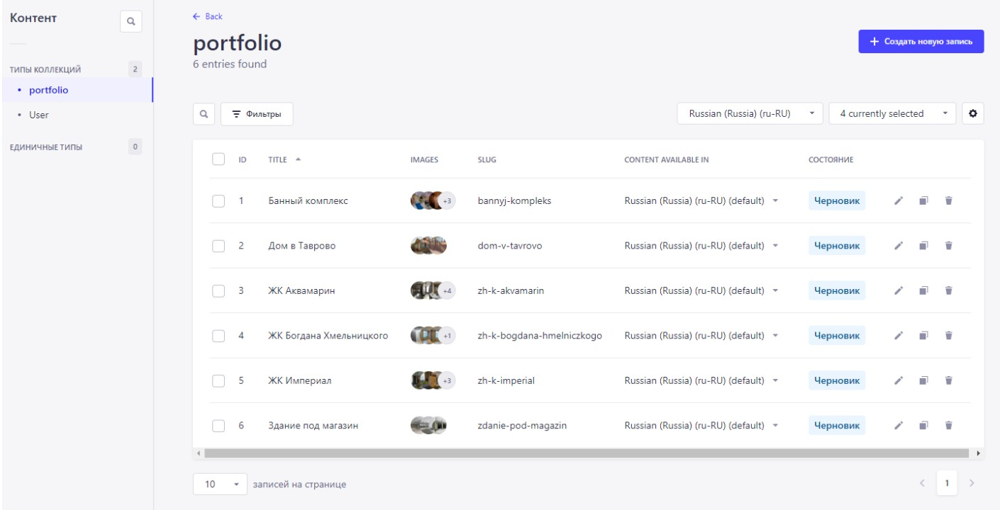

<h1 align="center">
    📰 Terminal
</h1>

## Проект Terminal развернут при помощи yarn create next-app --typescript

**[Ссылка на сайт](https://terminal-m31.ru/)**

Ссылка на репозиторий админки : **[strapi-terminal](https://github.com/Milanka-m/strapi-terminal)**

## ✍🏻 Краткое описание проекта
Проект представляет собой корпоративный сайт компании с полным описанием предоставляемых услуг, контактной информации, форм заявки.

Сайт состоит из 12 страниц:
- Главная. Содержит 10 информациооных блоков, включая динамический слайдер партнёров, выполненный с помощью Slider React Slick. Кейсы портфолио приходят при помощи асинхронных запросов к собственному API Strapi.
- Страница О нас. Содержит информационные блоки с описанием компании, этапы работ, портфолио работ, форму "Оставить заявку", отправка данных осуществляется в телеграм заказчика.
- Страница Услуги. Содержит информационный блок с карточками услуг, а также контактную информацию и яндекс карту.
- Страница Проекты. Содержит информационный блок с кейсами портфолио работ. Кейсы с портфолио приходят при помощи асинхронных запросов к собственному API Strapi. При клике по каждому из превью портфолио открывается модальное окно, которое содержит динамический слайдер с изображениями. Слайдер выполнен с помощью Slider React Slick.
- Страница Наши партнёры. Содержит информационный блок с логотипами партнёров.
- Страница Контакты. Содержит контактную информацию компании, а также форму "Оставить заявку".
- Страницы Строительство домов, Электромонтажные работы, Сантехнические работы, Внутренняя отделка, Дизайнерские решения, Благоустройство. Содержат по 6 информационных блоков с описанием услуги, включая форму "Оставить заявку", блок этапов работ и блок часто задоваемых вопросов.

API Strapi

## 📖 Задачи

- Проект адаптирован под различные разрешения экрана, соответствует макетам, сделанным для них.
- Все блоки из макета свёрстаны. Корректно работает навигация между страницами и ссылки на внешние ресурсы.
- Отзывчивая вёрстка, которая корректно тянется на всех промежуточных разрешениях.
- Отсутствуют ошибки валидации.
- В коде используется семантическая разметка: применяются семантические теги, выбор элементов при вёрстке корректен (параграф должен быть параграфом, список — списком); структура DOM-дерева состоит не только из контейнеров div.
- Для позиционирования элементов выбран верный подход, описанный корректным синтаксисом.
- Каркас макета реализован на `Flex layout` и/или `Grid layout`.
- Разметка портирована в TSX.
- Правильно работают оба состояния header.
- Правильно работает сабмит формы.

## 📃 Стек

- TSX, SCSS
- TypeScript
- React
- Next
- Node.js
- API Strapi
- БЭМ

## 💻 Установка зависимостей

##### `yarn` – установить зависимости проекта

##### `yarn dev` – запуск devServer на http://localhost:3000/

##### `yarn build` – production сборка проекта
